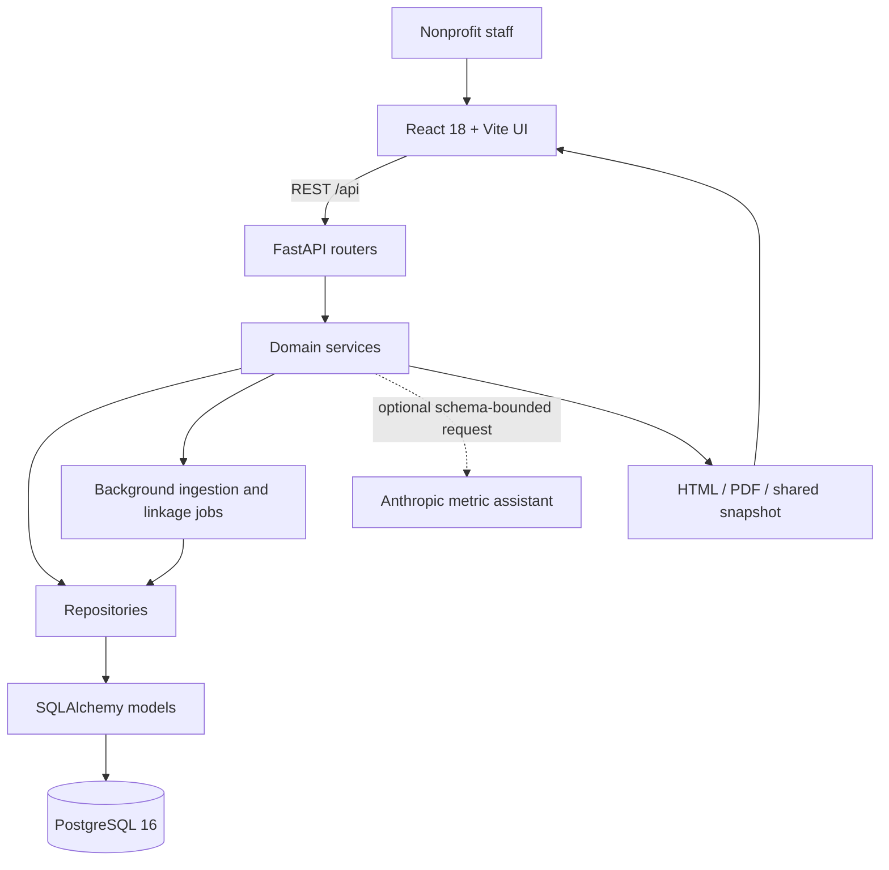
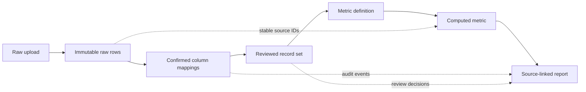

<div align="center">

# 🌿 Traceable

### Impact reports nonprofits can trust—even when the source data starts messy

Combine inconsistent program files, review uncertain matches, define understandable metrics, and trace every reported number back to the exact source records that produced it.

[](https://react.dev/)
[](https://vite.dev/)
[](https://fastapi.tiangolo.com/)
[](https://www.python.org/)
[](https://www.postgresql.org/)
[](https://docs.docker.com/compose/)
[](#-testing-and-quality-checks)

<br />


<br />

**[Quick Start](#-quick-start)** · **[Features](#-core-features)** · **[Architecture](#-system-architecture)** · **[Trust Model](#-trust-privacy-and-data-integrity)** · **[API](#-api-overview)** · **[Testing](#-testing-and-quality-checks)**

</div>

---

## 📌 Project Overview

**Traceable** is a full-stack impact-reporting platform for small nonprofits and community organizations whose program evidence lives across spreadsheets, attendance exports, donor files, surveys, and manually maintained records.

Instead of hiding uncertainty behind a polished total, Traceable keeps the complete evidence path visible:

```text
Messy files → Confirmed mappings → Human-reviewed matches → Defined metric → Source-linked report
     ↑                                                                          ↓
     └──────────────── Immutable records + append-only audit trail ─────────────┘
```

Every fuzzy match and AI-generated formula remains a suggestion until a person explicitly confirms it. Raw uploads are never silently edited, unresolved gaps stay visible, and beneficiary identities are pseudonymized outside the protected raw-record layer.

> [!IMPORTANT]
> Traceable reports only what the available records can support. Missing dates, unresolved duplicates, unmapped columns, excluded records, and metric caveats remain visible rather than being silently filled or hidden.

---

## ✨ Core Features

| Module | What it provides |
|---|---|
| 📥 **Immutable ingestion** | Imports CSV, XLSX, XLS, and JSON files while preserving every original row with a stable source-record ID. |
| 🔄 **Column reconciliation** | Suggests canonical field mappings with fuzzy matching, confidence scores, and mandatory human confirmation. |
| 🔍 **Duplicate review** | Uses multi-field record linkage and exposes name, date, program, and amount similarities before a reviewer decides. |
| 🧠 **AI-assisted metrics** | Converts a plain-language metric request into a validated formula draft without automatically saving or computing it. |
| 🧮 **Auditable calculations** | Stores the operation, field, filters, value, caveats, and exact source-record IDs behind every metric. |
| 🌞 **Metric sunburst** | Visualizes metrics in the inner ring and their contributing source files in the outer ring. |
| 🔗 **Data lineage** | Connects raw uploads, confirmed mappings, reviewed records, computed metrics, and final report evidence. |
| 🛡️ **Privacy safeguards** | Pseudonymizes beneficiary identities, encrypts identity mappings, applies role checks, and suppresses small groups. |
| 📄 **Report exports** | Produces designed HTML and PDF reports with metrics, evidence, caveats, and data-gap disclosures. |
| 👥 **Read-only sharing** | Creates immutable pseudonymized snapshots behind unguessable public report links. |

### Five-step workflow

| Step | Human decision |
|---|---|
| **1. Add files** | Select the program records that belong in the report. Original rows remain immutable. |
| **2. Match columns** | Confirm or override suggested mappings before any field is used in a calculation. |
| **3. Review duplicates** | Inspect explainable similarity evidence and decide whether records refer to the same beneficiary. |
| **4. Define metrics** | Review an AI-assisted draft or write a manual formula, then explicitly save and compute it. |
| **5. Share the report** | Inspect source records and data gaps, export PDF/HTML, or create a frozen read-only snapshot. |

---

## 🏗️ System Architecture



### Evidence lineage



### Layering model

```text
FastAPI routers → domain services → repositories → SQLAlchemy models → PostgreSQL
```

- Routers validate requests and translate domain errors into HTTP responses.
- Services own ingestion, reconciliation, linkage, metric computation, privacy, reports, and audit decisions.
- Repositories isolate queries and persistence behavior.
- SQLAlchemy event guards protect immutable uploads, raw records, and audit events.
- Persisted background-job records keep larger ingestion and duplicate scans from blocking HTTP requests.

See [`ARCHITECTURE.md`](ARCHITECTURE.md) for the full trust boundary, lineage model, and scaling path.

---

## 🛠️ Technology Stack

| Layer | Technology |
|---|---|
| Frontend | React 18, TypeScript, Vite 6, React Router, Axios, D3, Lucide icons, plain CSS |
| Backend | FastAPI, Uvicorn, Pydantic, Python 3.11+ |
| Persistence | SQLAlchemy, PostgreSQL 16 in Docker, SQLite for lightweight local development |
| Data processing | pandas, openpyxl, RapidFuzz, recordlinkage |
| Privacy and access | JWT roles, encrypted identity mapping, salted pseudonyms, k-anonymity threshold |
| AI assistance | Anthropic API with live-schema constraints and strict server-side validation |
| Reporting | ReportLab PDF, designed HTML, immutable shared snapshots |
| Infrastructure | Docker Compose, Nginx frontend proxy, FastAPI background tasks |
| Quality | pytest, ESLint, TypeScript compiler, Vite production build |

---

## 🚀 Quick Start

### Prerequisites

- **Docker Desktop** with Docker Compose
- Optional: an **Anthropic API key** for AI-assisted metric drafting

### 1. Configure the environment

```powershell
Copy-Item .env.example .env
```

Replace the demo credentials and secrets in `.env`. Leave `ANTHROPIC_API_KEY` empty if you want to use the manual metric builder only.

### 2. Start the complete stack

```powershell
docker compose up --build
```

| Service | Default URL |
|---|---|
| Traceable frontend | [http://localhost:8080](http://localhost:8080) |
| Backend API | [http://localhost:8000](http://localhost:8000) |
| API health | [http://localhost:8000/api/health](http://localhost:8000/api/health) |
| Swagger documentation | [http://localhost:8000/docs](http://localhost:8000/docs) |

### Demo access

| Role | Username | Local demo password |
|---|---|---|
| Organization administrator | `admin` | `admin-demo` |
| Report viewer | `viewer` | `viewer-demo` |

> [!WARNING]
> Change `JWT_SECRET`, both demo passwords, and `IDENTITY_ENCRYPTION_KEY` before using Traceable outside a local judging environment.

### Local development

Backend:

```powershell
python -m venv .venv
.venv\Scripts\Activate.ps1
pip install -e ".[test]"
uvicorn backend.app.main:app --reload --host 127.0.0.1 --port 8010
```

Frontend, in another terminal:

```powershell
cd frontend
npm install
npm run dev
```

Open [http://127.0.0.1:5173](http://127.0.0.1:5173).

---

## 🔐 Trust, Privacy, and Data Integrity

### Originals are immutable

- Every uploaded file and raw row receives a stable UUID.
- Renaming or removing a file from an active report creates a new audit decision; it does not rewrite the original evidence.
- Confirmed mappings, duplicate decisions, and corrections are stored as separate records.
- `transform_log` is append-only and protected by model-level mutation guards.

### Suggestions never become decisions automatically

- Fuzzy column mappings require confirmation.
- Duplicate candidates require a reviewer decision and are never auto-merged.
- AI metric formulas remain drafts until explicitly saved through the normal metric-definition endpoint.
- AI output is checked against the live confirmed schema and the allowed operation list before it reaches the UI.

### Every number keeps its evidence

- Computed metrics store the exact source-record UUIDs used in the calculation.
- Source tables use pseudonyms by default.
- Report caveats combine metric-specific exclusions with unresolved system-wide data gaps.
- The interactive sunburst uses source-linked record volume, avoiding misleading comparisons between incompatible units such as people, money, and averages.

### Identity protection

- Public views never expose raw beneficiary names or identifiers.
- Real identity mappings are encrypted separately and require the `org_admin` role.
- Small program/location groups below the configured k-anonymity threshold are suppressed.
- Shared links expose frozen, pseudonymized snapshots rather than live raw data.

---

## 🤖 AI Assistance Boundary

The metric assistant receives only:

1. The user's plain-language description.
2. The current human-confirmed canonical schema.
3. The allowed operations: `count`, `count_distinct`, `sum`, `avg`, `min`, and `max`.

The backend validates the returned JSON and rejects unknown fields or operations. If the request is ambiguous, the assistant asks for clarification. If the provider is unavailable, the manual formula builder continues to work.

```text
Natural-language request → Validated draft → Human review/edit → Explicit confirmation → Computation
```

AI assists with translation. It never confirms a mapping, merges records, saves a metric, or invents impact evidence.

---

## 🔌 API Overview

The complete interactive contract is available at `/docs` while the backend is running.

| Area | Representative endpoints |
|---|---|
| Health | `GET /api/health` |
| Authentication | `POST /api/auth/token` |
| Upload lifecycle | `POST /api/uploads`, `GET /api/uploads`, `PATCH /api/uploads/{id}`, `DELETE /api/uploads/{id}` |
| Background jobs | `GET /api/jobs/{id}` |
| Column reconciliation | `POST /api/uploads/{id}/mapping-suggestions`, `GET /api/mappings`, `POST /api/mappings/{id}/confirm` |
| Duplicate review | `POST /api/duplicates/scan`, `GET /api/duplicates`, `POST /api/duplicates/{id}/decision` |
| Metric builder | `POST /api/report/metric-definition/suggest`, `POST /api/report/metric-definition` |
| Metric computation | `GET /api/metrics`, `POST /api/metrics/{id}/compute` |
| Reports and lineage | `GET /api/report`, `GET /api/lineage`, `GET /api/report.html`, `GET /api/report.pdf` |
| Sharing | `POST /api/share-links`, `GET /api/public/reports/{token}` |
| Protected raw access | `GET /api/raw-records/{id}`, `GET /api/identity-mappings/{id}` |

---

## 🧪 Testing and Quality Checks

### Backend invariants

```powershell
.venv\Scripts\python.exe -m pytest
```

The **8-test invariant suite** covers immutable ingestion, confirmed mapping behavior, duplicate candidate generation, metric math, source-record lineage, audit logging, and privacy-sensitive report behavior.

### Frontend validation

```powershell
cd frontend
npm run lint
npm run build
```

The current verified state passes:

- `8 passed` with pytest
- ESLint with no errors
- TypeScript compilation
- Vite production build
- Browser interaction and console checks for the report sunburst

---

## 📁 Project Structure

```text
traceable-impact-reporting/
├── backend/
│   ├── app/
│   │   ├── routers/              # FastAPI transport layer
│   │   ├── models.py             # Immutable and append-only persistence models
│   │   ├── repositories.py       # Database access layer
│   │   ├── services.py           # Ingestion, linkage, metrics, privacy, and reports
│   │   ├── reporting.py          # HTML and PDF document rendering
│   │   └── security.py           # JWT roles, encryption, and pseudonymization
│   ├── tests/                    # Trust and invariant tests
│   └── Dockerfile
├── frontend/
│   ├── public/samples/           # Bundled demonstration records
│   ├── src/
│   │   ├── components/           # App shell, shared UI, workflow, and sunburst
│   │   ├── pages/                # Upload, mapping, review, metric, and report flows
│   │   ├── state/                # Persisted workflow state
│   │   ├── lib/api.ts            # Typed REST client
│   │   └── styles.css            # Token-based responsive design system
│   ├── DESIGN.md                 # Visual language and confirmation UX rules
│   └── Dockerfile
├── samples/                      # Deliberately messy demonstration datasets
├── docs/                         # Product visuals
├── ARCHITECTURE.md               # Layering, lineage, AI boundary, and scaling path
├── docker-compose.yml            # Frontend, backend, and PostgreSQL
├── pyproject.toml
└── README.md
```

---

## 🧭 Demonstration Flow

1. Select **Try sample data** or upload the deliberately inconsistent files in `samples/`.
2. Confirm the proposed column mappings and resolve every low-confidence field.
3. Run duplicate detection and inspect the per-field evidence for each candidate.
4. Describe a metric in plain language or use the manual formula builder.
5. Review the restatement and technical formula before explicitly saving it.
6. Open the report, switch metrics through the sunburst, and inspect the attached source records.
7. Review data gaps and assumptions before exporting HTML/PDF or creating a read-only link.

---

## 🎨 Product Design

Traceable uses a restrained nonprofit-reporting aesthetic designed to feel credible in front of program staff, boards, and funders.

- **Fraunces** for editorial report headings and large metric values.
- **Inter** for interfaces, evidence tables, and operational detail.
- Deep forest green for confirmed primary actions.
- Amber reserved for warnings, caveats, and missing evidence.
- Responsive layouts, keyboard-accessible controls, visible focus states, and reduced-motion support.
- Light and dark themes built entirely from CSS custom properties.

See [`frontend/DESIGN.md`](frontend/DESIGN.md) for the design tokens and suggestion-versus-confirmation interaction rule.

---

## 🤝 Contributing

1. Create a focused feature branch.
2. Preserve raw-record immutability and append-only audit behavior.
3. Never auto-apply fuzzy or AI-generated suggestions.
4. Keep every computed metric linked to exact source-record IDs.
5. Add or update tests for behavioral changes.
6. Run pytest, ESLint, and the production frontend build before opening a pull request.

---

<div align="center">

### Built to help small nonprofits spend less time defending numbers and more time understanding their programs.

Created by [Devendra Raj Singh](https://github.com/devendrarajsingh07)

</div>
